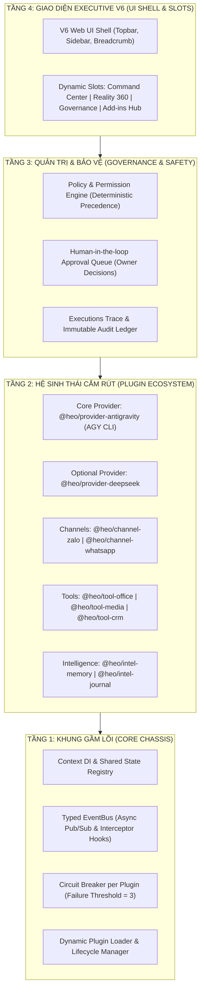

# HEO-HARNESS: SINGLE SOURCE OF TRUTH (SSOT)
## KIẾN TRÚC TRỤC CỨNG HỆ THỐNG ĐIỀU HÀNH EXECUTIVE ASSISTANT (HEO OS)

- **Tác giả sở hữu duy nhất:** Anh Cơ La (Ryan) — `genesis.corp.os@gmail.com`
- **Phiên bản:** SSOT v1.0.0
- **Ngày ban hành:** 19/09/2026
- **Nguyên tắc cốt lõi:** *"Sai một ly đi một dặm — Chuẩn hóa nền móng, cô lập rủi ro, nhất quán tuyệt đối."*

---

## 1. TRIẾT LÝ BẤT BIẾN (IMMUTABLE TENETS)

Mọi dòng mã và tính năng trong tương lai của dự án **BẮT BUỘC** tuân thủ 6 nguyên lý bất biến sau:

1. **Khung gầm tối giản (Chassis-First):** Core (`heo_harness/core`) chỉ đóng vai trò khung kết nối (Dependency Injection, Typed EventBus, Circuit Breaker, Lifecycle Hooks). Core **tuyệt đối không** chứa logic nghiệp vụ đặc thù của bất kỳ công cụ, mô hình hay kênh chat nào.
2. **Mọi thứ là Plugin (Everything is a Plugin):** Kênh chat (Zalo, WhatsApp), Mô hình AI (Antigravity CLI, DeepSeek), Công cụ (Drive, Office), Quản trị và cả Giao diện Web UI đều là các **Add-In Plugins** cắm vào Chassis.
3. **Core Agent là Antigravity CLI gói tháng:** Trái tim suy luận mặc định của Heo là Google Antigravity CLI (`@heo/provider-antigravity`) gói tháng cá nhân của Sếp Ryan. Mô hình khác (như DeepSeek V3/R1) chỉ là **Optional Secondary Provider** (bật/tắt tùy ý, không ràng buộc).
4. **Cô lập lỗi 100% (Fault Isolation & Circuit Breaker):** Một plugin bị crash, timeout, hoặc lỗi mạng thì chỉ riêng plugin đó bị ngắt mạch (`CIRCUIT_TRIPPED`). Core và các plugin khác (nhất là bot Zalo và Core Agent) vẫn hoạt động 100% bình thường.
5. **Dữ liệu thật & Minh chứng nguồn (Truth-Typing & Evidence Provenance):** Mọi thông tin hiển thị trên UI hoặc lưu trữ trong bộ nhớ phải phân loại rõ ràng:
   - `FACT`: Sự thật có nhật ký gốc từ kênh truyền.
   - `CALCULATED`: Tính toán xác thực qua công thức/luật nội bộ.
   - `INFERRED`: Suy diễn từ mô hình có độ tin cậy (`confidence < 1.0`).
   - `FORECAST`: Dự báo rủi ro có dẫn xuất bằng chứng.
   Mọi hành động đều phải có `correlation_id` và bằng chứng (`evidence`) có thể drill-down kiểm tra.
6. **Mô hình không tự cấp quyền (No Self-Authorization):** Model chỉ là đề xuất hành động. Mọi hành động gây tác động ngoại vi (gửi tin nhắn Zalo, chỉnh sửa lịch, xóa tệp) **phải qua Policy Engine** với thứ tự ưu tiên tuyệt đối:
   `GLOBAL -> CHANNEL -> GROUP -> PERSON -> ACTION`.

---

## 2. KIẾN TRÚC 4 TẦNG TRỤC CỨNG (4-LAYER ARCHITECTURE)



---

## 3. QUY CHUẨN ĐÓNG GÓI PLUGIN (PLUGIN SPECIFICATION CONTRACT)

Mỗi plugin trong `heo-harness` phải tuân thủ nghiêm ngặt cấu trúc thư mục và giao ước sau:

### 3.1. Cấu trúc thư mục
```
plugins/@heo/<plugin-id>/
├── manifest.json       # BẮT BUỘC: Bản mô tả chuẩn định danh, quyền, menu slot
├── __init__.py         # BẮT BUỘC: Khởi tạo module
├── plugin.py           # BẮT BUỘC: Lớp kế thừa BasePlugin
├── ui/                 # TÙY CHỌN: Giao diện web cắm vào V6 UI (HTML/JS/Vue)
└── tests/              # BẮT BUỘC: Kiểm thử cô lập của riêng plugin
```

### 3.2. Schema chuẩn của `manifest.json`
```json
{
  "id": "@heo/plugin-crm",
  "name": "HubSpot & Customer CRM Tracker",
  "version": "1.0.0",
  "author": "Ryan (Anh Cơ La)",
  "category": "tool", 
  "description": "Tự động đồng bộ liên hệ và nhật ký giao dịch từ CRM",
  "entrypoint": "plugin.py:CRMPlugin",
  "dependencies": [],
  "permissions": [
    "network:outbound:crm.example.com",
    "event:listen:channel:message:inbound"
  ],
  "ui_slot": {
    "nav_section": "Governance",
    "nav_item": "CRM & Khách Hàng",
    "nav_icon": "📇",
    "route": "crm_view"
  },
  "circuit_breaker": {
    "max_failures": 3,
    "recovery_timeout_sec": 60
  }
}
```

### 3.3. Các phân loại Plugin chuẩn (`category`)
1. `provider`: Cung cấp khả năng suy luận LLM (VD: Antigravity CLI, DeepSeek).
2. `channel`: Kênh liên lạc inbound/outbound (VD: Zalo Personal, WhatsApp, Telegram).
3. `tool`: Công cụ thực thi lệnh (VD: Document Parser, Calendar, Media, Shell).
4. `intelligence`: Phân tích insight, bộ nhớ dài hạn, quan hệ, dự báo.
5. `governance`: Kiểm soát chính sách, phê duyệt, chứng thực kiểm toán.
6. `ui`: Giao diện bổ sung hoặc widget điều khiển.

---

## 4. QUY CHUẨN GIAO DIỆN CHUẨN V6 (V6 EXECUTIVE UI SSOT)

Giao diện Web UI chuẩn hóa theo thiết kế [AGY_ASSIS_HEO_V6_WEB_UI_COMPLETE.html](file:///home/ryan/Documents/Ryan-Workplace/Heo-Harness/giao%20di%E1%BB%87n%20m%E1%BA%ABu/AGY_ASSIS_HEO_V6_WEB_UI_COMPLETE.html) với 5 phân hệ Sidebar bất biến:

| Phân hệ | Menu chuẩn | Trách nhiệm hiển thị |
| :--- | :--- | :--- |
| **1. Điều hành** | `Command Center`<br>`Attention Queue`<br>`Work OS`<br>`Calendar & Reminder` | Trả lời câu hỏi: *"Sếp cần chú ý và ra quyết định gì ngay bây giờ?"* |
| **2. Reality + Identity** | `Group 360`<br>`Person 360`<br>`Zalo / Channel Ops` | Thực tế khách quan: Con người thật, nhóm chat thật, trạng thái kết nối QR Zalo |
| **3. Intelligence** | `Insights & Forecast`<br>`Outcome & Value`<br>`Learning Loop` | Tri thức phái sinh: Tín hiệu quan hệ, cảnh báo trượt hạn, đo lường giá trị thật |
| **4. Governance** | `Approvals`<br>`Policy Engine`<br>`Executions & Trace`<br>`Tools & Add-ins Hub`<br>`Artifacts` | **Trái tim quản trị & Kho Plugin**: Duyệt hành động, cấu hình luật, bật/tắt Plugin một chạm, giám sát Circuit Breaker |
| **5. System** | `Control Room`<br>`Audit Ledger`<br>`Owner & Operations` | Hạ tầng kỹ thuật: Trạng thái CPU/RAM, sao lưu/khôi phục, nhật ký kiểm toán không thể sửa |

---

## 5. BẢNG TỪ ĐIỂN SỰ KIỆN CHUẨN (TYPED EVENTBUS DICTIONARY)

Mọi giao tiếp giữa các plugin và core **bắt buộc** dùng Typed Events thay vì gọi hàm trực tiếp:

| Sự kiện (Event Topic) | Payload chính | Trách nhiệm |
| :--- | :--- | :--- |
| `core:lifecycle:ready` | `{ timestamp, active_plugins }` | Khung gầm đã sẵn sàng |
| `channel:message:inbound` | `{ channel_id, sender_id, group_id, content, evidence_ref }` | Tin nhắn mới tới từ Zalo/kênh ngoài |
| `channel:message:outbound` | `{ channel_id, target_id, content, permit_id }` | Gửi tin nhắn ra ngoài (Cần permit!) |
| `model:prompt:request` | `{ prompt, context_frozen_id, correlation_id }` | Yêu cầu LLM suy luận |
| `model:prompt:stream` | `{ chunk, correlation_id }` | Dữ liệu phản hồi dạng stream |
| `policy:evaluate:request` | `{ actor, target, action, scope, payload }` | Yêu cầu Policy Engine cấp permit |
| `policy:evaluate:result` | `{ decision: ALLOW/APPROVAL/DENY, permit_id }` | Quyết định của hệ thống an toàn |
| `tool:execute:request` | `{ tool_name, args, permit_id }` | Yêu cầu chạy tool |
| `plugin:circuit:tripped` | `{ plugin_id, failure_count, last_error }` | Cầu dao cách ly plugin bị lỗi |

---

## 6. LỘ TRÌNH TRIỂN KHAI NHẤT QUÁN (5 PHASES)

- [x] **Phase 1: Hardened Chassis (ĐÃ HOÀN THÀNH):** Core Context, EventBus, CircuitBreaker, BasePlugin, Manager. Unit tests 100% PASS.
- [ ] **Phase 2: V6 UI Shell & Add-in Hub:** Chuyển hóa giao diện mẫu V6 thành Web UI chính thức (`@heo/ui-dashboard`), hỗ trợ render động các plugin và tab quản lý kho Plugin một chạm.
- [ ] **Phase 3: Core Provider AGY CLI (`@heo/provider-antigravity`):** Đóng gói connector gọi Google AGY CLI gói tháng làm model chính; cắm thêm stub `@heo/provider-deepseek` làm provider dự phòng.
- [ ] **Phase 4: Channel Zalo Packaging (`@heo/channel-zalo`):** Đóng gói module Zalo cá nhân hiện tại thành plugin chuẩn, cắm vào `Reality + Identity` và tích hợp quét QR an toàn.
- [ ] **Phase 5: E2E Verification & Phased Migration:** Chạy song song kiểm thử nghiệm ngặt trên máy chủ, xác thực E2E trace hoàn chỉnh trước khi chuyển đổi chính thức từ Heo v2.1.
